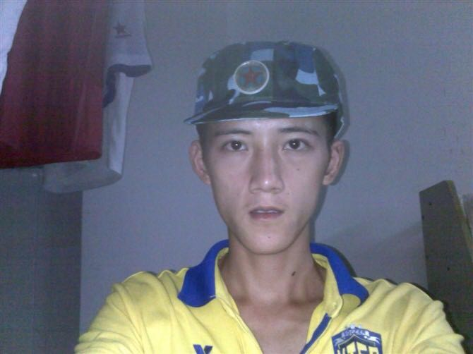
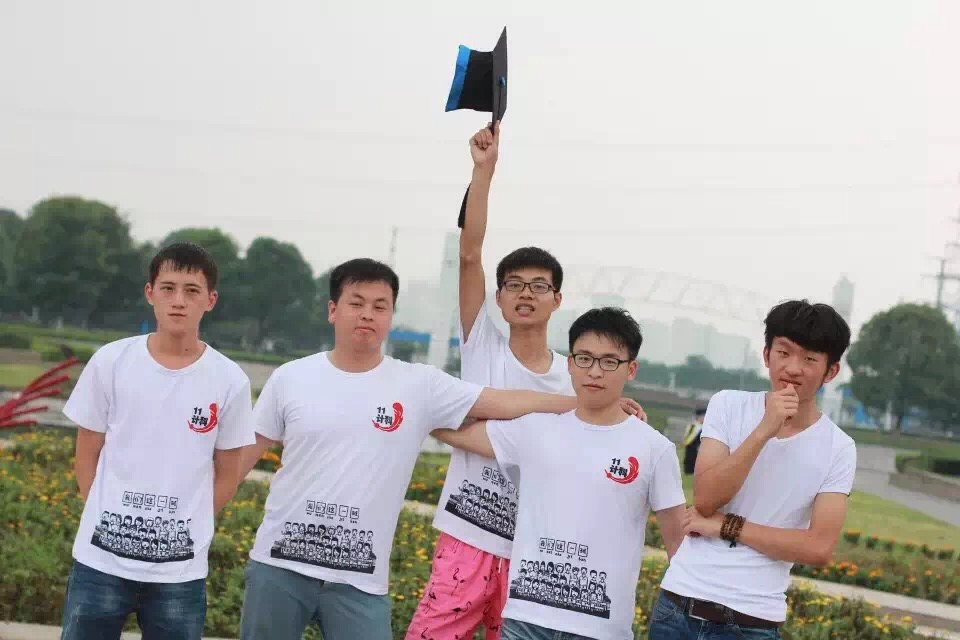
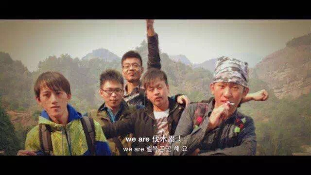

#CSaT_Ft
######我叫付锦，曾经有人叫我黄毛，这些都不重要，重要的是我现在干什么的。没错我是个程序员。在大学期间。从来没有想过。以后会当个程序员。但是不知不觉就做这行一年多了。ios开发虽然说入门很简单。但是我们该怎么学习呢。

####[如何学习](http://limboy.me/essay/2015/08/14/learning-how-to-learn.html)
####[学习资料](https://github.com/iOSBIGDay/iOS.Big.Day.Communication.High.Bige.Group)

-----------------
##游戏
######以上是我学习认真地一面，现在讲一下我玩英雄联盟的经历。先看看大一时候的我。

######这是刚军训时候的我，那时候还没有开始玩游戏。我有个室友他叫徐开，他是第一个玩这个游戏的。说重点，第一次玩英雄联盟的时候，有时候中饭的来不及吃。没错这就是这个游戏的魅力所在。从大一到大三，曾经无所次卸载这个游戏，后面又重装这个游戏。后面得了千手观音的称号。

####[玩了三年游戏的胖子](https://github.com/CSaTSunTory/firends/blob/master/CSaT_SunTory/CSaT_SunTory.md)

##旅游
######逗比五人组

##作者
CSaT丶SunTory （写不下去了，词穷）